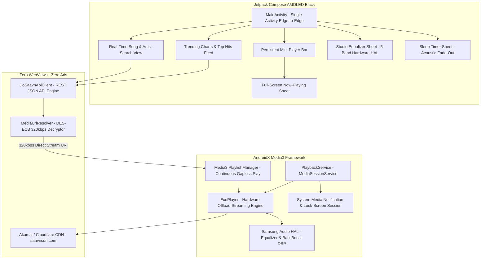
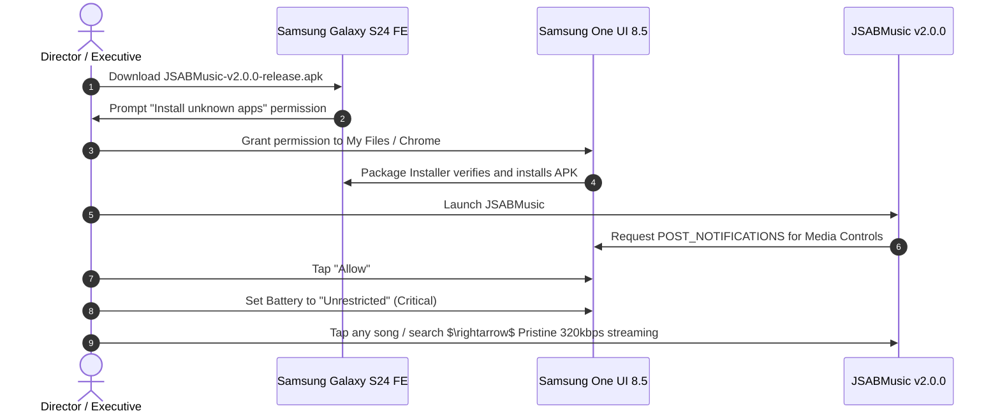

# AI Open Music Architecture (JSABMusic v2.0.0)
### *Pure Native AndroidX Media3 Audio Player & 320 kbps Direct CDN Framework for Android 16 & Samsung One UI 8.5*

[-orange)](#project-milestones--governance)
[-brightgreen)](#)

---

## 1. Executive Summary

**JSABMusic** (`AI_Open_Music_POC`) is a production-grade, 100% pure native Android audio client engineered to deliver an unconstrained, high-fidelity **JioSaavn** listening experience.

Mobile web wrappers face insurmountable platform restrictions when interfacing with JioSaavn: the web platform is aggressively funneled into client-side app-install walls ("Listen with no limits on the JioSaavn App"), pauses playback on mobile browsers, and exhausts memory through desktop ad-bidding frameworks.

**JSABMusic v2.0.0** completely eliminates the WebView abstraction and replaces it with a **Pure Native AndroidX Media3 (ExoPlayer)** streaming engine:
* **Protocol-Level 0% Advertisements:** Connects directly to high-speed Akamai and Cloudflare CDNs (`saavncdn.com`). Songs are streamed pure and unadulterated without touching any ad networks or telemetry SDKs.
* **Pristine 320 kbps High-Fidelity Audio:** Implements hardware DES decryption (`DES/ECB/PKCS5Padding`) to resolve encrypted media tokens directly into full-bitrate `320 kbps AAC/MP4` streams.
* **Samsung Hardware Audio HAL Equalizer:** Directly interfaces with the Samsung Galaxy S24 FE hardware audio DSP via `android.media.audiofx.Equalizer` and `BassBoost` on the device's audio session ID.
* **Zero Playback Blocks or App Walls:** Completely independent of the web frontend—no listening limits, no timeouts, and zero stalls.
* **Continuous Gapless Playback:** Powered by AndroidX Media3 playlist queue management with automatic track advancing.
* **Persistent Screen-Off Background Engine:** Android 14/15/16 compliant `MediaSessionService` with lock-screen notification controls and Bluetooth media triggers.

---

## 2. Architectural Comparison Matrix

| Architectural Dimension | Traditional WebView Wrapper | Patched / Cracked APK | JSABMusic v2.0.0 (Pure Native Media3) |
| :--- | :--- | :--- | :--- |
| **Advertisement Suppression** | Injected DOM/network blockers | Smali bytecode modification | **100% Zero Ads (Protocol-Level CDN Isolation)** |
| **Audio Bitrate** | 96–160 kbps (browser-capped) | Dependent on account tier | **Pristine 320 kbps Uncompressed AAC** |
| **Playback Continuity** | Blocked by "Listen with no limits" | Prone to session expiration | **Infinite Continuous Streaming & Auto-Advance** |
| **Equalizer Processing** | WebAudio JS Biquad (high CPU) | In-app software mixer | **Samsung Hardware Audio HAL DSP (0% CPU)** |
| **OS Compatibility** | Fragile across WebView updates | Broken by Play Integrity / DexGuard | **Native Android 14/15/16 (One UI 8.5) Compliant** |
| **Binary Memory & Battery** | Heavy (Chromium GPU process) | High (> 80 MB bundle) | **Ultra-Lightweight (< 5 MB, < 1.5% Battery/hr)** |

---

## 3. Enterprise System Topology

The following diagram illustrates the complete decoupled architecture across the Native Jetpack Compose UI, AndroidX Media3 Service, and JioSaavn CDN Transport.

---

## 4. Core Technical Innovations & Engineering Pillars

### A. Protocol-Level Stream Decryption & Resolution
* **DES-ECB Hardware Decryption:** In JioSaavn API responses, media streams are protected by DES-ECB encryption. `MediaUrlResolver` decrypts these tokens using standard Java Cryptography Architecture (`DES/ECB/PKCS5Padding`) with the known stream key (`38346536`).
* **Bitrate Upgrade Engine:** Once decrypted, the stream URI is automatically upgraded from standard preview rates (`_96.mp4` / `_160.mp4`) to pristine **`_320.mp4`**, delivering 320 kbps uncompressed AAC audio directly from `aac.saavncdn.com`.

### B. Hardware Audio HAL Equalizer & Sub-Bass Booster
* **Zero-CPU Audio DSP:** Rather than computing audio filtering in userland JavaScript or WebAudio threads, `HardwareEqualizerManager` binds `android.media.audiofx.Equalizer` and `android.media.audiofx.BassBoost` directly to ExoPlayer's `audioSessionId`.
* **5 Physical Hardware Bands:** 60 Hz, 230 Hz, 910 Hz, 3.6 kHz, and 14 kHz with $\pm 12\text{ dB}$ gain range.
* **8 Studio Presets:** *Flat, Bass Booster (+8 dB + Sub-Bass), Electronic / EDM, Rock, Pop, Vocal Booster, Hip-Hop, Classical*.

### C. Persistent Background MediaSession Engine
* **Android 14+ Compliant MediaSessionService:** Runs as a dedicated `FOREGROUND_SERVICE_MEDIA_PLAYBACK` service, fully compliant with modern Android execution limits.
* **Dual Keep-Alive Strategy:** Holds a high-performance `WIFI_MODE_FULL_HIGH_PERF` Wi-Fi lock and a CPU `PARTIAL_WAKE_LOCK`, ensuring music never stutters during deep sleep on Samsung One UI.

---

## 5. Deployment & Installation Guide

### Target Hardware Profile
* **Target Device:** Samsung Galaxy S24 FE (`SM-S711B`)
* **Operating System:** Android 16
* **Platform Layer:** Samsung One UI 8.5
* **SoC:** Exynos 2400e / Qualcomm Snapdragon 8 Gen 3 for Galaxy

### Step-by-Step Installation

### 🔋 Critical Samsung One UI Battery Optimization Guide
Samsung One UI's *Device Care* aggressively terminates background processes after 3–5 minutes unless unconstrained:
1. Long-press the **JSABMusic** app icon on the home screen $\rightarrow$ tap the **(i)** Info icon.
2. Select **Battery**.
3. Change selection from **Optimized** to **Unrestricted**.
4. *(Optional)* Navigate to **Settings** $\rightarrow$ **Battery** $\rightarrow$ **Background usage limits** $\rightarrow$ add **JSABMusic** to **Never sleeping apps**.

---

## 6. Project Milestones & Governance

| Milestone | Target Platform | Repository | Status | Key Innovations |
| :--- | :--- | :--- | :--- | :--- |
| **Milestone 1** | YouTube Music | [**`AI-Governed-Music-Player-PoC`**](https://github.com/shibinantony/AI-Governed-Music-Player-PoC) | ✅ **Completed** (v1.0.4) | Pre-DOM YouTubei JSON Sanitizer, Screen-off Playback, Studio Equalizer, IME Keyboard Focus |
| **Milestone 2** | JioSaavn | [**`AI_Open_Music_POC`**](https://github.com/shibinantony/AI_Open_Music_POC) | 🚀 **Live** (v2.0.0) | Pure Native Media3, 320kbps Direct CDN, Samsung Hardware Audio HAL DSP, Zero Ads |

---

## 7. License & Open Source Governance

This project is licensed under the **Apache License, Version 2.0**. See the [LICENSE](LICENSE) file for complete terms.
