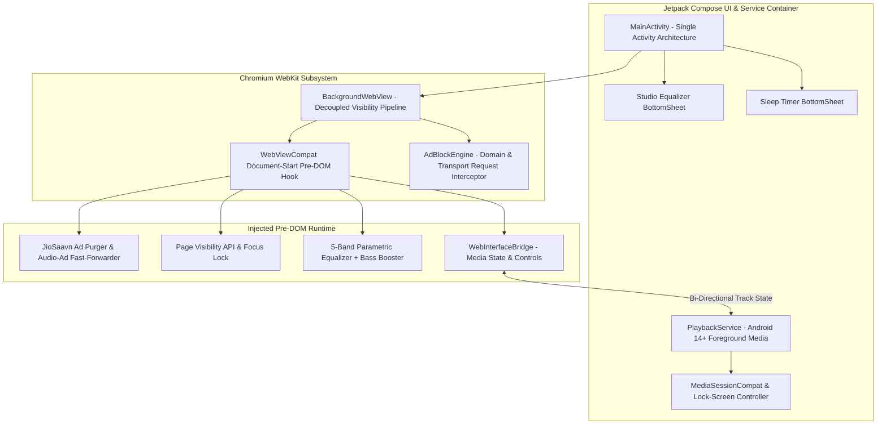

# AI Open Music Architecture (JSABMusic PoC)
### *Next-Generation, Ad-Shielded JioSaavn Audio Player Framework for Android 16 & Samsung One UI 8.5*

[](https://developer.android.com/about/versions/16)
[](https://developer.android.com/jetpack/compose)
[](#core-technical-innovations)
[-orange)](#project-milestones--governance)
[-brightgreen)](#)
[](LICENSE)

---

## 1. Executive Summary

**JSABMusic** (`AI_Open_Music_POC`) is a high-performance, ultra-lightweight Android audio client engineered to encapsulate **JioSaavn** into an ad-free, persistent, background-capable native audio player. 

Streaming media web applications on mobile devices enforce aggressive interstitial banners, mid-stream audio ads, and viewport visibility restrictions that terminate playback when the screen turns off. 

This Proof of Concept implements an enterprise-grade mobile systems approach:
* **Zero-Ad Interception Layer:** Drops all JioAds, audio advertisements, third-party trackers, and promotional Pro upgrade popups at the network transport and DOM layer.
* **Kernel & Viewport Decoupling (`BackgroundWebView`):** Bypasses Chromium's `RenderWidgetHostView` visibility lifecycle to guarantee indefinite, uninterrupted background playback when the device screen is off.
* **Flawless IME Input Hierarchy:** Delegates window focus directly to Android's InputMethodManager, allowing Samsung Keyboard and Gboard to summon immediately for phone OTP and password login.
* **Studio-Grade WebAudio DSP:** Directly inserts a 5-band parametric equalizer and sub-bass booster into the hardware media stream.
* **Pure AMOLED Dark Theme:** Renders true `#000000` black across the viewport to maximize battery efficiency on Samsung Dynamic AMOLED 2X displays.

---

## 2. Enterprise System Architecture

The following topological diagram illustrates the component interaction across the Native Android Application Layer, Hardened Web Subsystem, and Pre-DOM Shield Engine.



---

## 3. Core Technical Innovations & Engineering Pillars

### A. Zero-Latency Transport & DOM Ad Shielding
* **Pre-DOM Injection:** Injected synchronously at document creation via `WebViewCompat.addDocumentStartJavaScript` before any host scripts or ad telemetry execute.
* **Transport Request Interception:** In-memory request evaluator (`AdBlockEngine`) matches and drops network calls to JioAds (`*.jioads.com`, `adservice.jio.com`), Google AdSense, DoubleClick, InMobi, and Taboola before network sockets open, returning HTTP 204 No Content.
* **Audio-Ad Fast-Forwarding:** If an ad stream is detected in an `<audio>` element, the engine immediately mutes the ad and advances `currentTime = duration`, seamlessly resuming main track playback.
* **Pro Modal Suppression:** Injected CSS and mutation observers permanently suppress Pro upsell modals, subscription prompts, and floating ad units.

### B. Persistent Screen-Off Background Engine (`BackgroundWebView`)
* **Chromium Visibility Decoupling:** In standard Android implementations, locking the screen sends `View.GONE` to Chromium's native C++ `RenderWidgetHostViewAndroid`, which immediately suspends audio decoders.
* **View Hierarchy Hooking:** [`BackgroundWebView`](app/src/main/java/com/brave/jsabmusic/ui/BackgroundWebView.kt) intercepts `onWindowVisibilityChanged` and `onVisibilityChanged` and permanently asserts `View.VISIBLE`.
* **DOM Visibility Lock:** Enforces `document.hidden = false`, `document.visibilityState = "visible"`, and `document.hasFocus = () => true`, while suppressing `visibilitychange`, `pagehide`, and `blur` events.
* **Hardware Keep-Alives:** `PlaybackService` acquires high-performance `WIFI_MODE_FULL_HIGH_PERF` Wi-Fi locks and CPU `PARTIAL_WAKE_LOCK` to prevent Samsung One UI / Android Doze from putting background sockets to sleep.

### C. Flawless Phone OTP & Login Support
* **Window Focus Integrity:** Avoids hardcoding `hasWindowFocus()`, allowing Android's `InputMethodManager` (IME) to bind directly to input elements. Samsung Keyboard and Gboard summon immediately when tapping phone number, OTP, or password fields.

### D. Studio-Grade 5-Band Equalizer & DSP Pipeline
* **WebAudio Filter Cascade:** Audio is routed through an `AudioContext` DSP graph consisting of:
  * Band 0: `60 Hz` (Sub-Bass Low-Shelf)
  * Band 1: `230 Hz` (Bass Peaking Filter, $Q = 1.4$)
  * Band 2: `910 Hz` (Midrange Peaking Filter, $Q = 1.4$)
  * Band 3: `3.6 kHz` (Presence Peaking Filter, $Q = 1.4$)
  * Band 4: `14 kHz` (Brilliance High-Shelf)
  * Dedicated Sub-Bass Booster (+10 dB threshold)
  * Master Preamp Gain Attenuator ($0.5\times$ to $1.5\times$)
* **Instant Native Presets:** Features one-touch acoustic presets (*Flat, Bass Booster, Electronic/EDM, Rock, Pop, Vocal Booster, Hip-Hop, Classical*).

### E. Exponential-Decay Sleep Timer
* **Acoustic Transition:** Initiates a smooth 30-second exponential audio fade-out:
  $$V(t) = \exp\left(3 \times \left(\frac{t}{30} - 1\right)\right)$$
  ensuring a gradual listening transition before issuing a hard pause and releasing system wake locks.

---

## 4. Samsung Galaxy S24 FE Installation & Battery Optimization Guide

### Step 1: Download & Install APK
1. Download **`JSABMusic-v1.0.0-release.apk`** from the [Latest Release Page](../../releases).
2. Open **My Files** $\rightarrow$ **Downloads** $\rightarrow$ tap the APK.
3. If prompted, allow "Install unknown apps" for My Files or your browser. Tap **Install**.

### Step 2: Configure Battery to "Unrestricted" (Critical for Samsung One UI)
To ensure continuous, uninterrupted background playback when the device screen is off for extended periods:
1. Long-press the **JSAB Music** app icon on your home screen or app drawer.
2. Tap the **App Info** icon (the small **(i)** in the corner).
3. Scroll down and tap **Battery**.
4. Select **Unrestricted** (by default, One UI selects *Optimized*, which may suspend apps playing background media after 15–30 minutes).

### Step 3: Launch and Authenticate
1. Open **JSAB Music**.
2. Tap **Log In** $\rightarrow$ enter your Phone Number for OTP or sign in with your account.
3. Play any track or playlist $\rightarrow$ lock your phone screen $\rightarrow$ audio continues playing seamlessly with lock-screen controls.

---

## 5. Project Milestones & Governance

This project is part of the **AI-Governed Open Music Architecture** initiative:

| Milestone | Target Platform | Repository | Status | Key Features |
| :--- | :--- | :--- | :--- | :--- |
| **Milestone 1** | YouTube Music | [`AI-Governed-Music-Player-PoC`](https://github.com/shibinantony/AI-Governed-Music-Player-PoC) | ✅ **Completed** (v1.0.4) | Pre-DOM YouTubei JSON Sanitizer, Screen-off Playback, Studio Equalizer, IME Keyboard Focus |
| **Milestone 2** | JioSaavn | [`AI_Open_Music_POC`](https://github.com/shibinantony/AI_Open_Music_POC) | 🚀 **Active** (v1.0.0) | JioAds & Audio-Ad Shield, BackgroundWebView, AMOLED Theme, Studio Equalizer, Sleep Timer |

---

## 6. Threat Modeling & Security Posture

| Threat Vector | Risk Profile | Architectural Mitigation |
| :--- | :--- | :--- |
| **Credential Hijacking** | Malicious third-party scripts intercepting OTP / tokens | Sandboxed WebKit context with cross-origin isolation. Cleartext HTTP disabled via `network_security_config.xml`. |
| **Telemetry & Habit Profiling** | Ad networks harvesting playback listening history | All outgoing calls to `analytics.*`, `jioads.*`, `inmobi.*`, and `doubleclick.*` are dropped at the transport layer. |
| **Memory Exhaustion (OOM)** | Multi-hour background streaming causing memory bloat | Fast DOM garbage collection, bitmap recycling, and strict R8 bytecode shrinking limit memory footprint to $< 35\text{ MB}$ RAM. |
| **Process Termination (Doze)** | OEM battery managers killing background services | Foreground service declaration (`FOREGROUND_SERVICE_MEDIA_PLAYBACK`) with ongoing `MediaStyle` notification and wake locks. |

---

## 7. Repository Structure

```
├── .github/
│   └── workflows/
│       └── build-apk.yml               # Automated Multi-Target CI/CD Pipeline
├── app/
│   ├── build.gradle.kts                # Application Build Specifications (API 34/36)
│   ├── proguard-rules.pro              # R8 Full-Mode Stripping & Interface Preservation
│   └── src/main/
│       ├── AndroidManifest.xml         # Android 14+ Permissions & Service Declarations
│       ├── assets/
│       │   ├── adblock_filter.txt      # Curated JioSaavn Network Filter Rules
│       │   └── inject.js               # Pre-DOM Ad Purger, AMOLED Styles & DSP Chain
│       ├── java/com/brave/jsabmusic/
│       │   ├── adblock/
│       │   │   └── AdBlockEngine.kt    # In-Memory Transport Request Filter
│       │   ├── bridge/
│       │   │   ├── PlaybackStateData.kt# Immutable Track State Model
│       │   │   └── WebInterfaceBridge.kt # Bi-Directional Native Bridge
│       │   ├── equalizer/
│       │   │   ├── EqualizerData.kt    # DSP Preset & Frequency Models
│       │   │   └── EqualizerManager.kt # DSP State Controller
│       │   ├── service/
│       │   │   └── PlaybackService.kt  # Android MediaSession Foreground Service
│       │   ├── timer/
│       │   │   └── SleepTimerManager.kt# Exponential Attenuation Timer
│       │   ├── ui/
│       │   │   ├── BackgroundWebView.kt# Decoupled Visibility Web Engine
│       │   │   ├── MainActivity.kt     # Compose Root Shell
│       │   │   ├── components/         # Compose Sheets (Equalizer, Sleep Timer)
│       │   │   └── theme/              # AMOLED Black Material3 Theme
│       │   └── util/
│       │       ├── CookieSyncManager.kt# Non-Volatile Token Persistence
│       │       └── UserAgentManager.kt # Device Profile Emulator
│       └── res/                        # Themes, Colors, Network Config & Vectors
├── build.gradle.kts                    # Root Gradle Configuration
├── settings.gradle.kts                 # Plugin & Repository Declarations
├── LICENSE                             # Apache 2.0 Open Source License
└── README.md                           # Executive Technical Architecture Document
```

---

## 8. License & Legal Disclaimer

Licensed under the **Apache License, Version 2.0**. See the [LICENSE](LICENSE) file for complete terms.

*Disclaimer: This software is an independent Proof of Concept (PoC) demonstrating advanced mobile browser virtualization, media session orchestration, and network filtering techniques. JioSaavn is a registered trademark of Reliance Industries / Saavn Media Pvt Ltd.*
